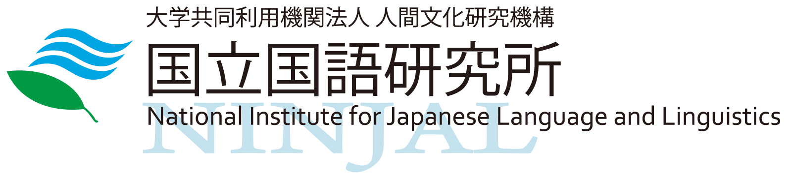
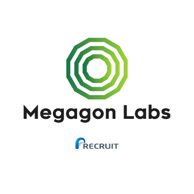
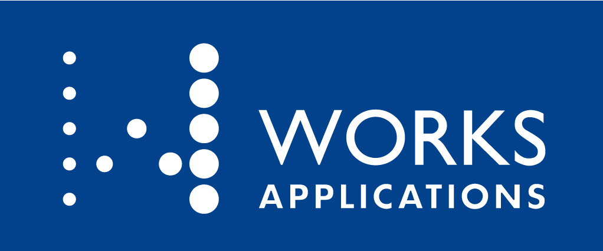

# JED2022 日本語における評価用データセットの構築と利用性の向上
2022年3月18日, オンライン開催

## JED2022ワークショップスポンサー

  

    <a href="https://www.ninjal.ac.jp/" target="_blank" rel="noreferrer">
      

      
国立国語研究所

    </a>
  

  

    <a href="https://www.megagon.ai/" target="_blank" rel="noreferrer">
      

      
Megagon Labs

    </a>
  

  

    <a href="https://www.worksap.co.jp/" target="_blank" rel="noreferrer">
      

      
株式会社ワークスアプリケーションズ ・エンタープライズ

    </a>
  

## 趣旨
**[言語処理学会第28回年次大会（NLP2022）](https://www.anlp.jp/nlp2022/) 併設ワークショップ - 日本語における評価用データセットの構築と利用性の向上（JED2022）**
日本語NLP技術の性能評価のためのデータセットが近年いくつか公開されているが，他の言語と比べると基本的なタスクが不足しており，日本語NLPの迅速な発展を阻害する要因となっている．英語などのデータセットを日本語に翻訳するアプローチもあるが，翻訳プロセスに由来するアーティファクトや文化の相違に起因するバイアスにより品質劣化が生じる場合が多いため，最初から日本語で構築したデータセットが増えていくことが望ましい．

本ワークショップでは，日本語における評価用データセットの構築手法そのものに加えて，データセットの公開方式・利用性の高い著作権設定・タスクの複合化といった応用を容易にするための研究を集めて議論することで，日本語データセット公開の流れを加速し，日本語NLP業界全体のさらなる発展および生産性向上につなげていきたい．

また，データセットによる評価の対象として利用されることが多い事前学習モデルについても，その構築過程で得られたノウハウを共有しデータセット構築に活用するためのセッションを設けて議論を深めることで，日本語データセットと事前学習モデルの相補的な発展につなげていきたい．

## What's new
2022.02.07 [仮プログラムを公開しました](#%E3%83%97%E3%83%AD%E3%82%B0%E3%83%A9%E3%83%A0)

## スケジュール
- 2021/11/25 (木)	JED2022 Webページ開設
- 2021/12/22 (水)	スケジュール公開
- 2021/12/23 (木)	一般発表・ライトニングトーク申込受付開始
- 2022/01/11 (火)	NLP2022事前参加登録受付開始
- 2022/01/21 (金)	JED2022ワークショップスポンサー受付開始
- 2022/02/14 (月)	一般発表申込締切・NLP2022事前参加登録締切
- 2022/02/18 (金)	プログラム公開・スポンサー受付終了
- 2022/02/28 (月)	ライトニングトーク申込締切
- 2022/03/11 (金) 正午まで	NLP2022直前参加登録締切
- 2022/03/14 (月)	発表スライド提出期限
- 2022/03/18 (金)	JED2022 ワークショップ当日

## 発表募集要項
### 募集する発表内容
自然言語処理のデータセットを構築されている方は，論文では語られない苦労話を含めて，日本語データセットの構築ノウハウをぜひご発表ください．
これから日本語データセットの構築を始めようとしている方には，それらのデータセットを構築する狙いについてご発表をお願いします．
また，自然言語処理に関する知識をお持ちかどうかを問わず，金融や医療といった応用領域の業務知見から，特定ドメインの日本語データセットの必要性を伝えるご発表を歓迎します.
さらに，日本語データセットの充実にむけて克服すべき障壁や課題，そしてそれらの解決に向けたアイディアのご発表も歓迎します.
なお，本ワークショップの発表は全てオンライン（Zoomを使用）で行い，スライド中心のカジュアルな発表・意見交換の場となるよう準備を進めて参ります.
下記に内容の例を示しますが，これらにとどまらず様々な取り組みについてご発表をお待ちします．

※発表希望者多数の場合，一般発表からライトニングへの振り分けや不採択とさせていただく場合がありますので，予めご了承ください．
#### 日本語における評価用データセットの構築と公開
- 例: 依存構造解析・固有表現抽出・含意関係認識など
- 専門家・クラウドソーシングによるアノテーション方法やデータセットの公開方法(ライセンスなど)におけるノウハウや問題点の共有
- 評価用データセットでの性能評価結果の共有・公開
#### データセット不足の解決と日本語NLP技術研究・産業応用の加速に向けた取り組み
- 大学や企業でのNLP技術教育の現場でどのような日本語データセットが必要とされているか
- 産業応用において強い需要を持つ日本語データセットの公開を通じた日本語の国際的市場価値の維持向上
- デファクトスタンダード化した英語ベンチマークに比肩する日本語評価用データセットをどのように構築していくか
#### 日本語事前学習モデル構築用大規模テキストデータの収集・公開および事前学習モデルの公開
- Webクローリングデータのクレンジング手法およびドメイン特化のための追加データ構築
- Webクローリングデータや各種企業内データを用いた事前学習モデルの構築と公開
### 発表スライドの事前提出について
- 発表で使用するスライドをPDF形式で事前に提出いただきます（論文の提出は不要です）．
- 公開を希望されない場合を除いてスライドはJED2022サイトに掲載いたします．問題が生じる懸念がある場合は修正をお願いすることがありますので，予めご了承ください．
- 発表スライドの著作権は発表者に帰属しますが，CC BY 4.0([Creative Commons Attribution 4.0 International License](https://creativecommons.org/licenses/by/4.0/deed.ja)) で公開することに同意していただきます．
### 発表方法
- Zoomミーティングによるオンライン開催
- 一般発表・ライトニングトークを含む全てのセッションをZoomを利用して実施します
### 発表種別
#### 一般発表
- 発表15〜25分 + 質疑5分
- 発表申込時に発表者・タイトル・概要(400字程度)を提出いただきます
#### ライトニングトーク
- 発表5分 + セッションの最後にまとめて質疑を行います
- 発表申込時に発表者・タイトル・概要(200字程度)を提出いただきます
### 発表申込期間
#### 一般発表
- 2021年12月22日(水)〜2022年2月14日(月)
#### ライトニングトーク
- 2021年12月22日(水)〜2022年2月28日(月)
### 発表スライド提出期限
- 2022年3月14日(月)
### 発表申し込みフォーム
[JED2022の発表申し込みフォーム](https://docs.google.com/forms/d/e/1FAIpQLSfQjhS6afxXJ67wZ4y-nDHWtkkH5BxDjRvURhxPp255TvwIWw/viewform)
### 発表者のNLP2022参加登録について
JED2022は言語処理学会第28回年次大会(NLP2022)の併設ワークショップとして開催されます．JED2022に参加するにはNLP2022に参加登録（有料）を行う必要があります．NLP2022の参加登録は事前登録が2022/01/11から2022/02/14まで，直前登録は2022/03/11正午に締切です．
## プログラム
※各セッションのタイトルはすべて仮のものです。開始・終了時間は最終的な発表申し込み数により変更される場合があります。
### [09:20-12:30] 午前の部
#### [09:20-] オープニング
#### [09:30-] 日本語評価用データセットの構築と公開（１）
#### [11:00-] 日本語評価用データセットの構築と公開（２）
#### [11:45-] リレートーク（１）：統語解析データセット・モデルの公開

### [13:30-17:30] 午後の部
#### [13:30-] 特別講演: [柿沼太一先生（弁護士, STORIA法律事務所）](https://storialaw.jp/lawyer/3041)
専門分野はスタートアップ法務及びデータ・AI法務．現在，様々なジャンル（医療・製造業・プラットフォーム型等）のAIスタートアップを，顧問弁護士として多数サポートしている．経済産業省「AI・データ契約ガイドライン」検討会検討委員（～2018.3）．日本ディープラーニング協会（JDLA）有識者委員（2020.5～）．「第2回 IP BASE AWARD」知財専門家部門グランプリを受賞（2021）．
#### [15:00-] リレートーク（２）：（調整中）
#### [15:30-] 日本語評価用データセットの構築と公開（３）
#### [15:55] リレートーク（３）：日本語評価用データセットの研究と産業応用の加速
#### [16:35-] パネルディスカッション：日本語大規模事前学習モデルと評価用データセットの利用促進
#### [17:20-] クロージング

## 参加申し込み
[言語処理学会第28回年次大会（NLP2022）](https://www.anlp.jp/nlp2022/)へ参加登録することで，当ワークショップにもご参加いただけます．

## JED2022ワークショップスポンサーの募集
JED2022ではワークショップ独自のスポンサーを下記の内容で募集いたします．  
※ JED2022ワークショップスポンサーは言語処理学会第28回年次大会のスポンサーとは異なるJED2022独自のものです  
### JED2022ワークショップスポンサー募集要項
- お申し込み期限：2022年2月18日(金)まで
- スポンサー料金：税込55,000円を言語処理学会にお支払いいただきます
  - JED2022ワークショップスポンサーにランクはありません
  - 見積書・請求書は「一般社団法人 言語処理学会」の名義で発行いたします
  - お支払いは口座振込のみ承ります
  - 個別契約や特殊な請求処理についてはお受けできない場合があります
### JED2022ワークショップスポンサー特典
1. JED2022サイトトップページおよびプログラムページにロゴの掲載が可能（ページ表示幅の約20%の正方形領域・URLリンクの設定が可能）
1. JED2022ワークショップの午前の部・午後の部の開始前にZoom画面で共有するタイトルスライドにロゴの掲載が可能（共有画面幅の約15%の正方形領域）
1. 昼休憩中にZoom画面で共有するスライドショーに静止画広告（音声なし）を1枚差し込み可能

※ ロゴの掲載はロゴデータ受取後2営業日以内に開始〜2022年3月末までとなります  
※ ロゴや静止画広告の表示順序は全てお申し込み順となります  
※ JED2022ワークショップスポンサー特典に無料参加枠はございません（ワークショップに参加される方はNLP2022への参加登録が必要です）  
※ JED2022ワークショップスポンサーは同時に開催される他のワークショップとは無関係です  
### JED2022ワークショップスポンサーのお申し込み
お申し込み・ご質問は下記メールアドレスまでお気軽にお問い合わせください．  
Email: jed2022 (at) googlegroups.com

## 提案者
- 浅原正幸 <small>国立国語研究所</small>
- 河原大輔 <small>早稲田大学</small>
- 久保隆宏 <small>アマゾンウェブサービスジャパン合同会社</small>
- 柴田知秀 <small>ヤフー株式会社</small>
- 高岡一馬 <small>株式会社ワークスアプリケーションズ・エンタープライズ</small>
- 林部祐太 <small>株式会社リクルート Megagon Labs</small>
- 久本空海 <small>株式会社Legalscape</small>
- 松田寛 <small>株式会社リクルート Megagon Labs</small>

問い合わせ先 jed2022 (at) googlegroups.com
